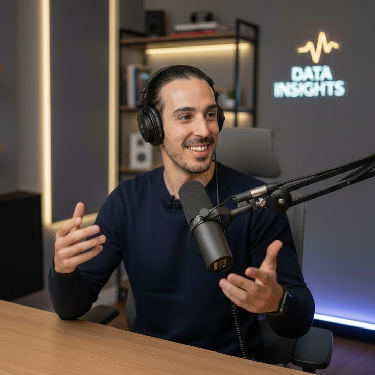

# Hi, I'm Miguel 👋🏼 I build AI systems and document the journey

### A 10+ years journey turning *AI theory* into *production reality*

- Wondering how AI solves *YOUR* specific business problems?
- Tired of AI projects that never make it past the PowerPoint?
- Overwhelmed sorting real AI solutions from the noise?
- Worried about hallucinations, privacy, and vendor lock-in?
- Need a clear roadmap from AI pilot to production?
- Ready to be in the 5%[1](https://fortune.com/2025/08/18/mit-report-95-percent-generative-ai-pilots-at-companies-failing-cfo/) whose AI solutions actually bring ROI?

[Book Intro Call :material-arrow-top-right:](https://calendar.app.google/2FvRfdbidFFGPKcu6){ .md-button .md-button--primary target="_blank" }

{ .profile-image alt="Portrait of Miguel Miranda Dias, AI entrepreneur" }

## About me

Hi! I'm Miguel, an entrepreneur and educator living in France. I work with technical professionals facing the overwhelming pace of AI innovation and businesses struggling to translate AI hype into competitive advantage. Whether you're a developer watching your skills becoming obsolete or a company unsure how to implement AI effectively—the challenge is the same: how to effectively use this technology before your competitors do.

My artificial intelligence journey spans over a decade, with bachelor's and master's degrees in the field and experience building custom data and AI systems across utilities, government, and e-commerce sectors. My tech stack includes Python, PostgreSQL, ML, FastAPI, OpenAI, Claude, Azure, vector databases, RAG, and LLM integration for enterprise applications.

## Things I'm working on

Here's an overview of everything I'm currently working on in the fields of AI, education, and entrepreneurship.

-   :fontawesome-solid-building-user:{ .lg .middle } [Datavengers™](https://www.datavengers.tech/)

    ---

    Datavengers is my company, which I founded in 2024. It has since grown beyond just me, and we now focus on building intelligent data-centric solutions, helping businesses effectively implement and leverage AI technologies.

-   :material-youtube:{ .lg .middle } [YouTube](https://www.youtube.com/@pandego?sub_confirmation=1)

    ---

    Following my passion for making videos and educating, I share my journey and lessons on YouTube in the form of practical tutorials on how to build data and AI applications. Subscribe to follow the journey!

-   :material-school:{ .lg .middle } [Freelancing](https://calendar.app.google/2FvRfdbidFFGPKcu6)

    ---

    I offer my services as a freelancer to help businesses implement AI and data solutions. Whether you need help with a specific project or want to build a custom data and AI system, I can help.

-   :material-rocket:{ .lg .middle } AI Solutions

    ---

    I specialize in rapid development and deployment of AI solutions. Using modern tools and proven frameworks, I can help you move from concept to production faster, giving you a competitive edge in today's fast-paced market.

## Why work with me?

Here's what sets me apart and how I can help drive value for your business:

-   :fontawesome-solid-building-user:{ .lg .middle } Proven Business Experience

    ---

    As the founder of Datavengers, I bring entrepreneurial insight to every project. I understand both the technical and business sides of AI implementation, ensuring solutions that deliver real ROI and align with your business goals.

-   :material-youtube:{ .lg .middle } Educator & Communicator

    ---

    My experience as a content creator and educator means I can break down complex technical concepts into clear, actionable insights. You'll always understand the 'why' behind technical decisions and get clear progress updates.

-   :material-school:{ .lg .middle } Industry Expert

    ---

    With over a decade in AI and data science, including work across utilities, government, and e-commerce sectors, I bring battle-tested expertise to your projects. My solutions are built on real-world experience, not just theory.

-   :material-rocket:{ .lg .middle } Fast Implementation

    ---

    I specialize in rapid development and deployment of AI solutions. Using modern tools and proven frameworks, I can help you move from concept to production faster, giving you a competitive edge in today's fast-paced market.

## What people say about working with me

-   :material-format-quote-open:{ .lg .middle } Ludovic Gardy
    
    Founder at Sotis Advanced Insights

    ---
    
    "Miguel stands out for his ability to quickly grasp complex topics, understand critical challenges, and identify key issues. **His expertise in AI and MLOps enables him to build robust pipelines and contribute effectively to end-to-end solutions**, always delivering clean, efficient execution with a proactive mindset. Importantly, he excels in an industrial environment by skillfully managing project constraints and task coordination while **developing comprehensive roadmaps with clearly defined scopes.**"

-   :material-format-quote-open:{ .lg .middle } Nicolas Baillot d'Estivaux
    
    Chief Data Officer at bioMérieux

    ---

    "Miguel has a very strong technical background, **is able to lead important projects, to make the accurate technical choices** and always learns new things and try to implement them in the profesional context. His support was **highly valuable for the data team and for the company.**"

-   :material-format-quote-open:{ .lg .middle } Mehdi Elion
    
    Senior Data Scientist at Mirakle

    ---

    "Miguel has definitely shown **the best qualities one could dream of in an AI Tech Lead**. He's kind, passionate, supportive, encourages you to grow both professionally and technically. **He's also one of the most reliable techies I've worked with: Miguel is the go-to guy whether it is for pure data science, hardware setup, solution deployment or even networking issues.** It has been an honor to work with him, and I strongly recommend to have him in your team if you get the opportunity to do so."

-   :material-format-quote-open:{ .lg .middle } Antonio Jacinto
    
    Plant Manager at Forvia

    ---

    "**Miguel's expertise in machine learning and deep learning, particularly in computer vision and its application to industrial cases has been pivotal in our success.** His programming skills are exceptional, and **his ability to navigate complex technical challenges and to propose innovative solutions** significantly contributed to the success of our initiatives. **His contributions have left a lasting impact.**"

## Frequently asked questions

??? note "How quickly can you start working on my project?"
    I can typically begin new projects within 1-2 weeks of contract signing. For urgent matters, I maintain some flexibility for rapid response situations and can potentially start sooner - just let me know your timeline during our initial consultation.

??? note "Do you require a minimum project size or commitment?"
    While I can accommodate projects of any size, I find that engagements of at least 20 hours per week allow for meaningful impact. This gives us enough time to understand your data, implement solutions, and deliver actionable results. We can start with a small pilot project to ensure we're a good fit.

??? note "What industries do you have experience in?"
    I've successfully delivered projects across biotech, healthcare, manufacturing, and automotive sectors. While I specialize in data science & AI fundamentals that apply across sectors, I particularly excel in projects involving the implementation of AI solutions such as RAG and LLM integration for enterprise applications.

??? note "How do you handle data security and confidentiality?"
    I take data security extremely seriously. I sign comprehensive NDAs before starting any project, use enterprise-grade encryption for all data transfers, and follow industry best practices for data handling. I can also work within your existing security infrastructure and policies.

??? note "What's your pricing structure?"
    I offer both project-based and retainer pricing models. Project fees are based on scope, complexity, and value delivered rather than hours worked. For ongoing support, I offer flexible retainer packages. Let's discuss your specific needs during our consultation to determine the most cost-effective approach.

??? note "How do you communicate progress and results?"
    I maintain clear communication through weekly progress updates and regular check-in meetings. You'll receive detailed documentation of all analyses, findings, and recommendations. For ongoing projects, I provide interactive dashboards and reports that allow you to track progress and results in real-time.

-   :material-coffee:{ .lg .middle } Let's have a virtual coffee together!

    ---
    
    Want to see if we're a match? Let's have a chat and find out. Schedule a free 30-minute strategy session to discuss your AI challenges and explore how we can work together.

    [Book Intro Call :material-arrow-top-right:](https://calendar.app.google/2FvRfdbidFFGPKcu6){ .md-button .md-button--primary target="_blank" }

