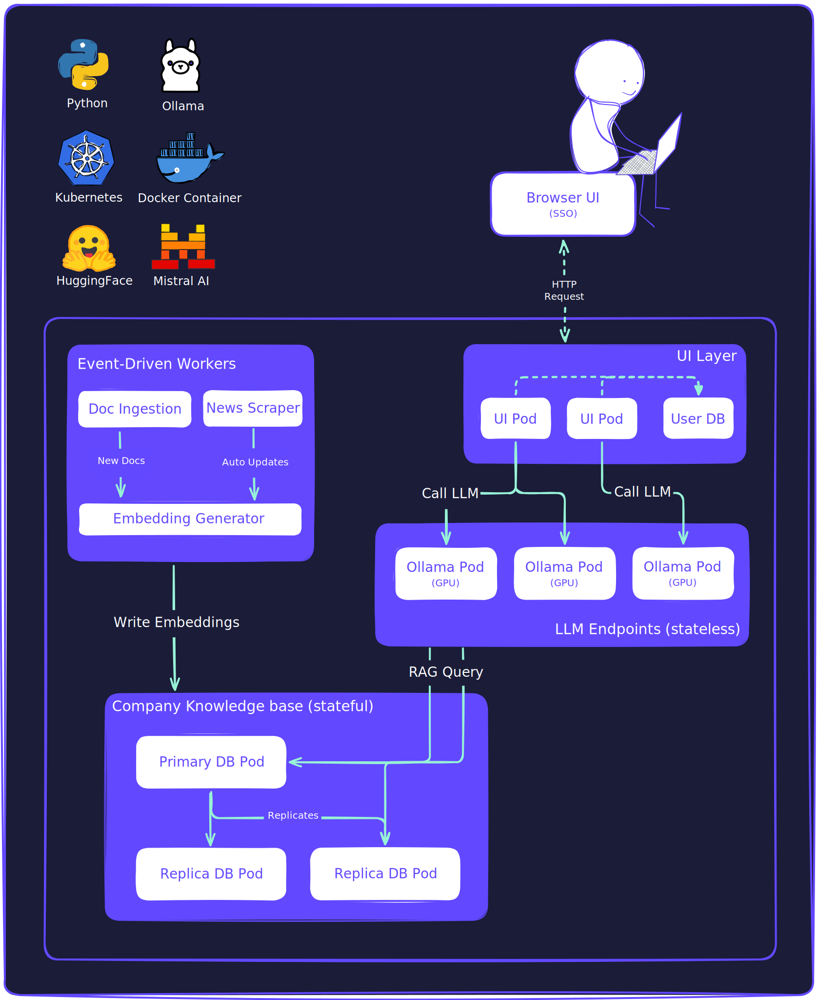

# Secure Enterprise AI Assistant (EU Enterprise)

!!! abstract "Case Study Summary"
    **Client**: Confidential / Leading European EV Battery Manufacturer  
    **Website**: —  
    **Industry**: Automotive (EV Battery Manufacturing)  

    **Impact Metrics**:

    - Eliminated risk of data leakage from external AI tools (100% local processing)  
    - Reduced onboarding document review time by ~70%  
    - Scaled seamlessly from 20 → 300 concurrent users with <2s latency  
    - Enabled secure multilingual translation across 5+ languages  
    - Continuous ingestion of company news and onboarding documents  

Built a secure, enterprise-grade AI assistant, a ChatGPT-like tool deployed fully on-premises. The system combined a deterministic RAG pipeline using a centralized knowledge base, real-time translation, and a React-based UI. It enabled global employees to interact with a private AI assistant without leaking any sensitive information.

## Challenge

Employees were increasingly using public tools (ChatGPT, Google Translate) for document digestion and translation. This posed two core risks:  
1. **Data leakage** to external AI platforms  
2. **Inconsistent document analysis quality**  

The client required a fully local AI assistant, scalable, multilingual, and compliant with internal data governance.

## Our Approach

We implemented a secure hybrid architecture with full separation of concerns:  
- A **React-based frontend** with SSO login managed user sessions and chat interactions.  
- A dedicated **user database** stored chat history, settings, and user preferences.  
- A **vector database (PostgreSQL + pgvector)** held embedded company knowledge, optimized for RAG use.  
- **Distributed Ollama LLM endpoints** were deployed across a local 9-GPU HPC cluster.  
- **Event-driven pipelines** handled ingestion of documents, embedding generation, translation, and news updates.  

Each component was isolated and containerized, enabling scalable, fault-tolerant operations while enforcing data boundaries between chat storage and knowledge retrieval.

## Results & Impact

- ✅ Achieved complete local deployment, removing all dependency on external AI services  
- 📈 Improved onboarding efficiency by ~70% through instant document summarization  
- 🛡️ Prevented knowledge base "pollution" by separating user metadata from vector knowledge  
- ⚡ Maintained <2s latency for 300+ concurrent users via GPU-distributed inference endpoints  
- 🌍 Enabled fast, private multilingual translation across departments  

## Solution Overview

*A secure local AI assistant architecture using a React-based UI, user DB, Ollama endpoints on 9x Nvidia GPUs HPC, and pgvector-based RAG pipelines.*

## Tech Stack

- **Infrastructure**: On-prem HPC cluster (9x Nvidia GPUs)  
- **Frontend**: React-based UI with SSO  
- **LLM Runtime**: Ollama endpoints (local, GPU distributed)  
- **Vector DB**: PostgreSQL + pgvector  
- **User DB**: PostgreSQL (chat metadata, settings)  
- **Ingestion Pipelines**: Python-based, event-triggered  
- **Containerization & Scaling**: Docker, optionally Kubernetes (bare-metal)

## Additional Context

- **Timeline**: ~4 months (architecture → deployment)  
- **Team Size**: 4 (AI Tech Lead, Data Scientists x2, MLOps Engineer) 
- **Role**: AI Tech Lead
- **Collaboration**: Worked with Data, IT, and Infra teams to align deployment with internal compliance
- **Future Plans**: Add per-user document memory, fine-tune internal LLMs on internal terminology, build adoption analytics

-   :material-coffee:{ .lg .middle } Let's have a virtual coffee together!

    ---
    
    Want to see if we're a match? Let's have a chat and find out. Schedule a free 30-minute strategy session to discuss your AI challenges and explore how we can work together.

    [Book Intro Call :material-arrow-top-right:](https://calendar.app.google/2FvRfdbidFFGPKcu6){ .md-button .md-button--primary target="_blank" }

