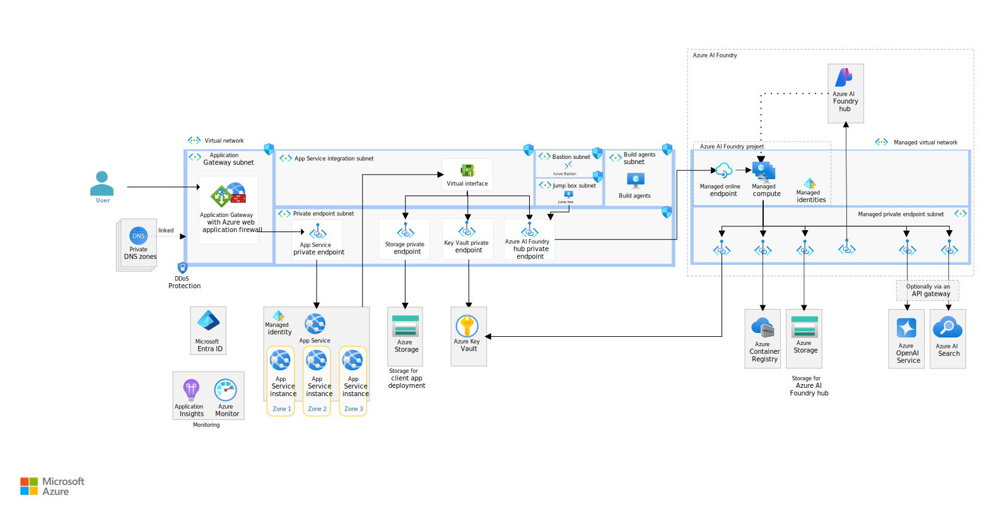

# AI Patent Trend Analysis for EV Batteries (Confidential EU Enterprise)

!!! abstract "Case Study Summary"
    **Client**: Confidential (EU enterprise)  
    **Website**: —  
    **Industry**: Automotive (EV batteries)  
    
    **Impact Metrics**:
    
    - **−90%** review/labeling time per weekly batch (from **5 days → 0.5 day**)  
    - **−90%** manual classification overhead for the IP team  
    - **≈ €490k/year** cost savings (10 IP engineers @ €50k/yr; weekly task reduced 5d → 0.5d → 45 person-days saved/week × 48 weeks × €227/day)  
    - Analysts reallocated from manual tagging to higher-value trend interpretation

The IP team needed faster, consistent insight into thousands of new patents to inform R&D on emerging EV-battery technologies. We delivered a pipeline that turns raw patent exports into titled clusters with summaries and a trends dashboard.

## Challenge

IP engineers were manually scanning and tagging multilingual patents—slow, inconsistent, and hard to replicate at scale. Multilingual content and unstructured abstracts made it difficult to compare filings and report consolidated trends to innovation stakeholders.

## Our Approach

We built REST endpoints for **language detection → translation → domain-specific embedding → unsupervised clustering → cluster summarization → trend tracking**, exposed via a FastAPI service on Azure and backed by a vector index for semantic lookups. Clusters receive concise titles/summaries and can optionally align to **IPC** categories for consistent reporting.

## Results & Impact

- Weekly patent exports processed into **digestible, titled clusters** with auto-summaries  
- **Review loops cut from hours to minutes** per batch  
- Earlier visibility of emerging themes; analysts focus on interpretation vs manual tagging  
- Stable, repeatable releases with containerized CI/CD

## Solution Overview

*Baseline chat/RAG reference architecture adapted for patent analytics (diagram placeholder).*

## Tech Stack

- **Vector index**: Databricks **Mosaic AI Vector Search**  
- **Cloud**: Microsoft **Azure** (compute, storage, networking)  
- **Backend**: **Python** services with **FastAPI** (REST)  
- **Containerization**: **Docker**  
- **CI/CD**: **Azure DevOps Pipelines**  
- **LLM & embeddings**: **OpenAI** (summarization, domain embeddings)  
- **Translation**: **Azure AI Translator**  
- **Data platform**: Databricks APIs for ingestion & jobs

## Additional Context

- **Timeline**: ~4 months  
- **Team Size**: 4  
- **Role**: AI Tech Lead  
- **Collaboration**: Close with IP analysts for evaluation loops and taxonomy alignment  
- **Future Plans**: Feedback signals into clustering/evals; optional supervised topic labels

**Three Key Points**

1. **Domain-specific embeddings** tuned for EV-battery patents to improve cluster cohesion.  
2. **Unsupervised clustering** with optional **IPC-guided labels** for standardized taxonomy.  
3. **Trend analytics dashboard** to monitor cluster momentum and surface emerging themes.

-   :material-coffee:{ .lg .middle } Let's have a virtual coffee together!

    ---
    
    Want to see if we're a match? Let's have a chat and find out. Schedule a free 30-minute strategy session to discuss your AI challenges and explore how we can work together.

    [Book Free Intro Call :material-arrow-top-right:](https://calendly.com){ .md-button .md-button--primary }

